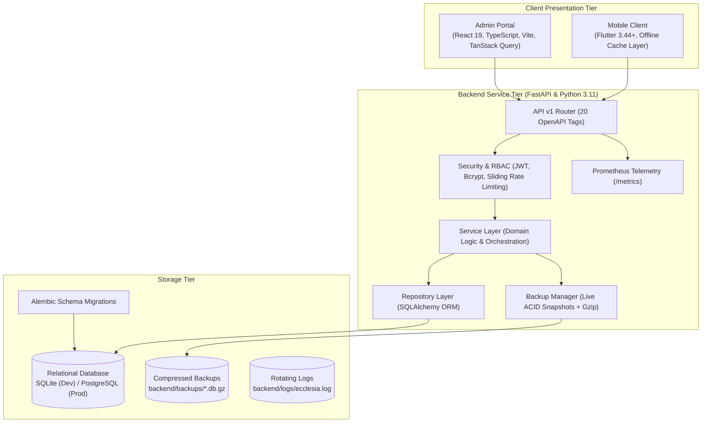

# Ecclesia — Enterprise Church Management System (ChMS)

[](https://fastapi.tiangolo.com)
[](https://react.dev)
[](https://flutter.dev)
[](https://alembic.sqlalchemy.org)
[](https://prometheus.io)
[](https://playwright.dev)
[](LICENSE)

**Ecclesia** is a modern, modular, production-grade Church Management System (ChMS) engineered for local churches, dioceses, and Christian non-profit organizations. It pairs a **FastAPI** backend with a **React 19** administrative portal and an offline-resilient **Flutter** mobile client.

---

## Architecture & System Overview



---

## Key Capabilities & Modernizations

- **Security & RBAC**: RFC 7519 signed JWT tokens, bcrypt hashed credentials, sliding-window rate limiting on login attempts, and strict role hierarchy (`super_admin`, `admin`, `pastor`, `treasurer`, `staff`, `viewer`).
- **Church Calendar Integration & Subscriptions**: RFC 5545 standard `.ics` exports, 1-click Google Calendar sync (`calendar.google.com/calendar/r?cid=...`), and WebCal live subscription feeds (`webcal://`) empowering congregation members to sync church events directly into Apple Calendar, Google Calendar, and Outlook across web and mobile.
- **Customizable Multi-Channel Alert & Notification Engine**: Role-specific alerts strictly guarded for pastors and admins. Evaluates consecutive attendance absences (configurable threshold) and urgent pastoral needs, with multi-channel dispatch via In-App PWA Web Notifications, Email, and WhatsApp.
- **Answered Prayers & Testimony Wall**: Dedicated spiritual milestone tracker recording answered prayers, praise reports, answer rate percentages, average days to breakthrough, and 1-click shareable testimonies.
- **Database Schema Versioning (Alembic)**: Automated, repeatable migrations across development (SQLite) and production (PostgreSQL) databases under `backend/alembic/`.
- **Operational Observability (Prometheus)**: Live telemetry exposed via `GET /metrics` tracking request counts, latency histograms, in-flight connections, and SQLAlchemy pool states.
- **Automated Live Database Snapshots**: Non-blocking `sqlite3.backup()` snapshots with gzip compression, automatic retention pruning (keeping last 10 snapshots), directory traversal defense, and admin web management.
- **Offline-First Mobile App**: Layered clean architecture (`mobile/lib/`) with in-memory and disk caching fallback (`OfflineCacheService`) for field ministry.
- **Interactive OpenAPI Documentation**: Comprehensive Swagger UI at `/docs` featuring 20 categorized domain tags and `HTTPBearer` token persistence.
- **Centralized Telemetry**: Correlated logging via `X-Request-ID` tracing across React and FastAPI.

---

## Quick Start

### 1. Backend API (FastAPI)

```powershell
cd backend
python -m venv .venv
.\.venv\Scripts\Activate.ps1
pip install -r requirements.txt

# Run database migrations
python -m alembic upgrade head

# Start development server
uvicorn app.main:app --reload --port 8000
```
- API Endpoint: `http://localhost:8000`
- Interactive OpenAPI Docs: `http://localhost:8000/docs`
- Prometheus Metrics: `http://localhost:8000/metrics`

### 2. Admin Portal (React 19 + TypeScript)

```powershell
cd admin-portal
npm install
npm run dev
```
- Local URL: `http://localhost:5173`

### 3. Mobile Client (Flutter 3.44+)

```powershell
cd mobile
flutter pub get
flutter run
```

---

## Automated Verification & Test Suites

Ecclesia features 100% automated test coverage across all application tiers:

### Backend Pytest Suite (66 Tests — 100% Pass)
```powershell
cd backend
python -m pytest
```
*Validates calendar export & subscriptions, alert rules & multi-channel notifications, answered prayer tracking, Alembic migrations, Prometheus metrics, database backups, audit logging, RBAC security, error envelopes, and connection pooling.*

### Frontend Playwright E2E Suite (15 Tests — 100% Pass)
```powershell
cd admin-portal

# Desktop Suite (1280x720)
npm run test:e2e:desktop

# Mobile Viewport & Responsiveness Suite (iPhone 13 & iPhone SE)
npm run test:e2e:mobile
```

### Mobile Flutter Suite (13 Tests + 0 Warnings — 100% Pass)
```powershell
cd mobile
flutter test
flutter analyze
```

---

## Documentation Hub

Comprehensive engineering and operational documentation is available in the [`docs/`](docs/) directory:

| Document | Focus & Description |
| :--- | :--- |
| [System Architecture](docs/ARCHITECTURE.md) | C4 diagrams, layered clean architecture, domain models, and design patterns |
| [Database Schema & ERD](docs/DATABASE_SCHEMA.md) | Complete Entity-Relationship Diagram, table data dictionary, and Alembic versioning |
| [Observability & Telemetry](docs/OBSERVABILITY_GUIDE.md) | Prometheus metrics catalog, scraper configuration, Grafana panels, and alerting rules |
| [Mobile Client Architecture](docs/MOBILE_ARCHITECTURE.md) | Flutter modular architecture, offline-first caching, Material 3 theming, and QA |
| [REST API Reference](docs/API_REFERENCE.md) | Full endpoint specification, request schemas, error envelopes, and system APIs |
| [Production Deployment Guide](docs/DEPLOYMENT.md) | Multi-stage Docker, PostgreSQL stack, Nginx reverse proxy, and cron backup jobs |
| [Centralized Logging](docs/CENTRAL_LOGGING_GUIDE.md) | `X-Request-ID` correlation architecture, rotating log handlers, and log aggregation |
| [ChMS User & Setup Guide](docs/CHMS_USER_AND_SETUP_GUIDE.md) | Practical administrator manual and module setup instructions |
| [Playwright Test Report](docs/PLAYWRIGHT_TEST_REPORT.md) | Automated E2E verification results, mobile responsiveness audits, and snapshots |
| [Security Policy](SECURITY.md) | Vulnerability disclosure policy, supported versions, and built-in defense measures |
| [Code of Conduct](CODE_OF_CONDUCT.md) | Contributor standards, responsibilities, and enforcement guidelines |
| [Changelog](CHANGELOG.md) | SemVer release history adhering to Keep a Changelog |

---

## License

This project is licensed under the MIT License — see the [LICENSE](LICENSE) file for details.
