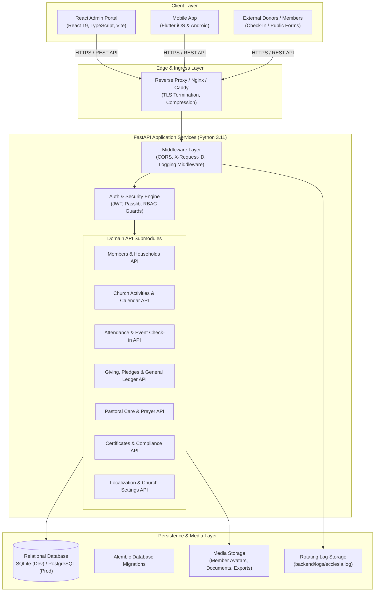
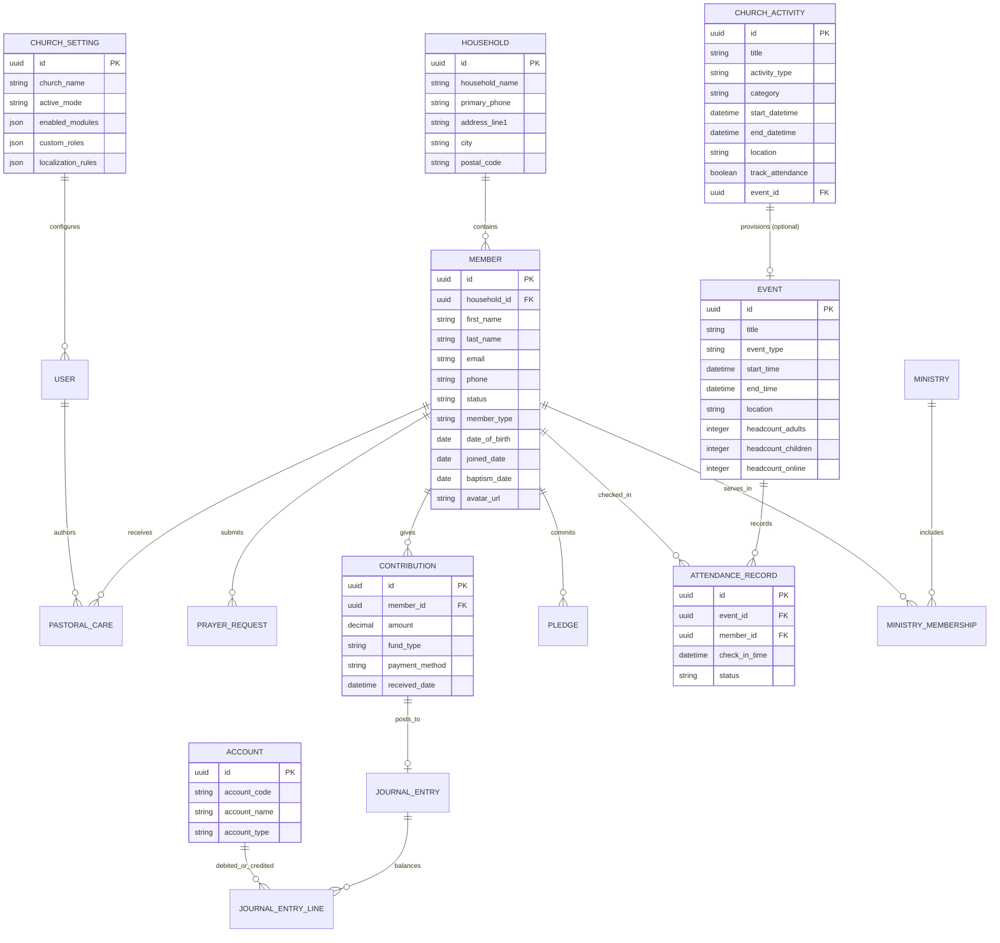
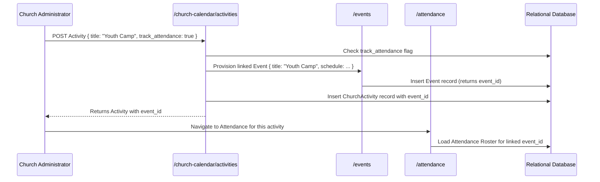

# Ecclesia System Architecture Documentation

**Product**: Ecclesia Church Management System (ChMS)  
**Version**: 0.3.0  
**Authors**: Ecclesia Engineering Team  
**Last Updated**: September 2026  

---

## 1. Executive & Architectural Overview

Ecclesia is an integrated, modular, multi-tenant capable Church Management System (ChMS) engineered to serve small-to-enterprise churches, parishes, dioceses, and denominational bodies. The platform balances high operational velocity with robust data integrity, auditability, and role-based security.

### Core Architectural Principles
1. **Separation of Concerns**: Presentation (React SPA & Flutter mobile), Business Logic & API Layer (FastAPI), and Persistence (SQLAlchemy ORM + SQLite/PostgreSQL).
2. **Modular Domain Driven Design**: Core church entities (Members, Households, Ministries, Activities, Attendance, Giving, Pastoral Care, Compliance, Ledger) are encapsulated with explicit relationship contracts.
3. **Traceability & Correlation**: Every interaction across the client and server is correlated via unique `X-Request-ID` telemetry headers.
4. **Resilient Data Contracts**: Strongly typed Pydantic models for request/response serialization paired with SQLAlchemy ORM models.

---

## 2. High-Level Architecture Diagram

---

## 3. Technology Stack & Component Specifications

| Layer | Technology | Rationale & Responsibility |
| :--- | :--- | :--- |
| **Admin Frontend** | React 19, TypeScript 5, Vite | Ultra-fast build times, strict static typing, responsive component architecture with zero bloat. |
| **Routing & Navigation** | React Router (`react-router-dom` v7) | Declarative client-side routing, deep-linking, bookmarkable URLs, and browser history management. |
| **Server State Management** | TanStack Query (`@tanstack/react-query` v5) | Stale-while-revalidate caching, in-memory query deduplication, and targeted cache invalidations. |
| **Styling & Theme** | Vanilla Modern CSS (Tokens, CSS Grid, Flexbox) | High-performance styling without heavy CSS framework abstractions, sleek dark/light adaptable interface. |
| **Mobile Client** | Flutter 3 (Dart) | Cross-platform native compilation for iOS and Android member directories and pastoral lookups. |
| **Backend API** | FastAPI (ASGI / Starlette / Uvicorn) | High-throughput asynchronous Python framework, automatic OpenAPI (Swagger) generation, dependency injection. |
| **Architecture Pattern** | Controller -> Service -> Repository | Clean separation of routing controllers, domain business logic services, and persistence repositories. |
| **Data Validation** | Pydantic v2 | Strict serialization, deserialization, type coercion, and request validation. |
| **ORM & Migrations**| SQLAlchemy 2.0 + Alembic | Declarative relationship mapping, database neutrality (seamless switch between SQLite and PostgreSQL). |
| **Authentication & Security**| HS256 Signed JWT + Sliding Rate Limiter | Cryptographically signed tokens with expiration and sliding-window rate limiting on sensitive routes. |
| **Central Logging** | Python `logging.handlers.RotatingFileHandler` | Structured rotational file logging with `contextvars`-based request correlation tracking. |
| **E2E Testing** | Playwright (Chromium) | Headless and headful automated testing covering desktop viewports and mobile device profiles. |

---

## 4. Entity-Relationship & Domain Model Architecture

The data architecture reflects real-world church operations: individual members belong to households, participate in ministries, attend scheduled activities (which auto-provision check-in events), give tithes/pledges recorded in the double-entry ledger, and receive pastoral care.

---

## 5. Cross-Module Integration Lifecycle

### A. Church Activities $\leftrightarrow$ Check-In Event Synchronization
When pastors or administrators schedule an activity in the church calendar, the system bridges the activity with the event check-in subsystem:

- **Update Propagation**: Modifying the activity's title, dates, or location automatically syncs to the linked `Event` record.
- **Toggle Lifecycle**: Switching `track_attendance` from `false` to `true` dynamically creates the `Event`; switching from `true` to `false` cleanly detaches it.

### B. Standardized Attendance Calculation Formula
To prevent discrepancies between manual headcounts, online broadcast participants, and individual member check-ins, attendance across all reports (Executive Dashboard, Event Summaries, CSV Exports) uses a single unified formula:

$$\text{Total Attendance} = \max\left(\text{headcount\_adults} + \text{headcount\_children},\; \text{roster\_checked\_in\_count}\right) + \left(\text{headcount\_online} \lor 0\right)$$

### C. Member Profile Photo Upload & Retention Lifecycle
1. **Pre-Save Upload**: Frontend uploads file to `POST /api/v1/members/upload-avatar`.
2. **MIME & Size Validation**: Validates file magic bytes (`image/jpeg`, `image/png`, `image/webp`), enforces 5MB limit.
3. **Storage Sanitization**: File stored under `backend/uploads/avatars/avatar_<uuid>.<ext>`.
4. **Old File Cleanup**: When a member's photo is updated or deleted, the preceding physical file is automatically unlinked from the filesystem to avoid storage leakage.

---

## 6. Authentication, Security & RBAC Model

Ecclesia enforces security at the edge, in the routing layer, and within database queries:
- **Authentication**: Stateless JSON Web Tokens (JWT) signed with HMAC-SHA256 (`HS256`).
- **Password Hashing**: Bcrypt with salted rounds.
- **RBAC Roles & Permissions**:
  - `Admin`: Full system access, localization, RBAC configuration, audit logs.
  - `Pastor / Clergy`: Pastoral care records, prayer requests, counseling notes, member directories, attendance rosters.
  - `Finance Officer`: Contributions, pledges, expenses, general ledger journal entries, donor tax statements.
  - `Staff / Volunteer`: Check-in operations, calendar schedules, ministry attendance.
- **Data Protection & Confidentiality**: Pastoral care entries support strict confidentiality flags restricting access to authorized pastoral personnel.

---

## 7. Centralized Logging & Telemetry

Ecclesia incorporates request-level correlation IDs:
1. Client generates or receives `X-Request-ID` (e.g., `req_b678c2e9b08f`).
2. FastAPI middleware captures header and sets an asynchronous ContextVar (`request_id_ctx`).
3. Python `logging` filters inject `request_id` into every log statement.
4. Latency is measured via high-resolution monotonic clocks (`time.perf_counter()`).
5. Logs are persisted to `backend/logs/ecclesia.log` using `RotatingFileHandler` (10MB max, 5 backups).

---

## 8. Service & Repository Layer Patterns

Ecclesia isolates database query mechanics from business rules:
- **Repository Layer (`backend/app/repositories/`)**: Encapsulates raw SQLAlchemy query expressions, filtering, sorting, pagination, and transactional commits.
- **Service Layer (`backend/app/services/`)**: Implements domain business rules, cross-entity orchestration, validation, audit log generation, and event dispatch.
- **Controller Layer (`backend/app/api/v1/`)**: Pure HTTP adapters handling request parsing, Pydantic validation, dependency injection, and standardized error envelopes.

---

## 9. Database Migrations (Alembic) & Backup Snapshots

- **Alembic Versioning (`backend/alembic/`)**: Provides repeatable, declarative migration scripts for schema evolution across development (SQLite) and production (PostgreSQL).
- **ACID-Safe Live Backups (`backend/app/core/backup.py`)**: Uses non-blocking `sqlite3.backup()` with gzip compression, automated retention pruning (keeping last 10 snapshots), and directory traversal protection.
- **Immutable Audit Trail (`app/models/audit_log.py`)**: Statutory record of all mutations, backups, and user logins.

---

## 10. Prometheus Operational Observability

- **Metrics Collection (`backend/app/core/metrics.py`)**: Instruments HTTP request counts, latency histograms, in-flight requests, and database pool states.
- **Scraping Endpoint (`GET /metrics`)**: Formatted in standard Prometheus text exposition for Prometheus servers, Grafana dashboards, and Alertmanager.

---

## 11. Mobile Client Architecture & Offline Resilience

- **Layered Architecture (`mobile/lib/`)**: Core config, domain models, services, and feature modules.
- **Offline Caching (`OfflineCacheService`)**: In-memory and local disk persistence allowing congregation directories and event calendars to remain accessible when network signal is lost.

---

## 12. Church Calendar Subscriptions & Google Calendar Integration

The Calendar Integration subsystem bridges church administrative planning with personal digital calendars used by church members:
- **RFC 5545 iCalendar Engine (`backend/app/core/calendar_export.py`)**: Generates compliant `.ics` calendar streams with `VEVENT`, `UID`, `SUMMARY`, `DESCRIPTION`, `LOCATION`, and `DTSTART`/`DTEND` timestamps formatted in UTC (`%Y%m%dT%H%M%SZ`).
- **Live WebCal Feeds (`GET /api/v1/church-calendar/feed.ics`)**: Emits `text/calendar; charset=utf-8` enabling dynamic subscriptions via Apple Calendar, Google Calendar, and Microsoft Outlook (`webcal://...`).
- **1-Click Google Calendar Integration**: Formats direct web subscription links (`https://calendar.google.com/calendar/r?cid={url}`) and single-event links (`https://calendar.google.com/calendar/render?action=TEMPLATE&...`) to permit members to add events to their personal accounts with a single click.
- **Multi-Platform Access**: Exposed in both the React Admin Portal (`ChurchCalendarView.tsx`) and Flutter Mobile App (`events_page.dart`).

---

## 13. Automated Multi-Channel Alert & Notification Engine

Pastoral staff require timely, role-specific alerts when members drift from active engagement or require emergency pastoral intervention:
- **Notification Rule Model (`NotificationRule`)**: Configurable triggers specifying target event types (`member_absence`, `urgent_pastoral_need`), threshold values (e.g. 2 consecutive absences), dispatch channels (`in_app`, `email`, `whatsapp`), target roles (`pastor`, `admin`, `super_admin`), and customizable message templates with token substitution (`{{member_name}}`, `{{threshold_value}}`, `{{phone}}`).
- **Attendance Absence Evaluator (`AlertService`)**: Analyzes historic attendance records (`AttendanceRecord.status.in_(["Present", "Late"])`) against member rosters to calculate consecutive missed services and fire automated alerts when thresholds are reached.
- **Multi-Channel Dispatcher**:
  - **In-App PWA Web Notifications (`InAppNotification`)**: Persisted in the database with unread counters, click-to-navigate action URLs, and role filtering.
  - **Email Alerts**: Dispatched using church SMTP credentials.
  - **WhatsApp Alerts**: Routed via church WhatsApp Business API webhook configurations.
- **Strict Role-Based Scoping**: Handled through `require_role("super_admin", "admin", "pastor")` guards on all alert endpoints and UI navigation elements.

---

## 14. Answered Prayers & Praise Testimony Tracker

Spiritual milestones and praise testimonies are central to pastoral care and congregational encouragement:
- **State Transition (`POST /api/v1/pastoral/prayers/{id}/answer`)**: Marks a prayer request as answered, recording the `answered_at` timestamp and an optional detailed praise testimony.
- **Testimony Wall Feed (`GET /api/v1/pastoral/prayers/answered`)**: Provides categorized, searchable answered prayers for pastoral celebrations.
- **Pastoral Analytics (`GET /api/v1/pastoral/prayers/stats`)**: Calculates high-level prayer metrics including Total Requests, Answered Count, Answer Rate Percentage, and Average Days to Breakthrough.

