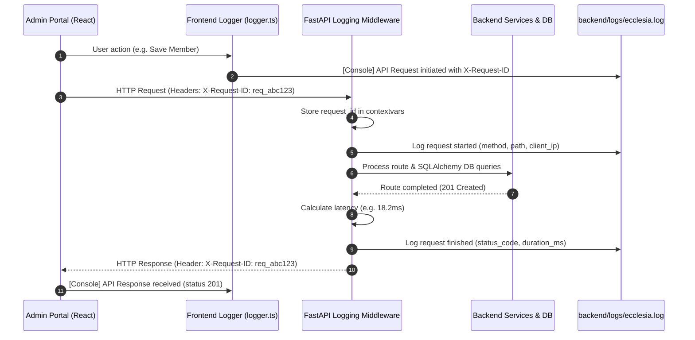

# Central Logging Architecture & Operations Guide

**Project**: Ecclesia Church Management System (ChMS)  
**Modules**: Backend FastAPI Service & React Admin Portal  
**Log Storage**: `backend/logs/ecclesia.log` (rotating file handler, UTF-8 encoded)

---

## 1. Overview & Architecture

Ecclesia employs an end-to-end centralized logging structure connecting frontend client interactions with backend API request processing. Every incoming request is tagged with a unique Correlation Request ID (`X-Request-ID`), allowing end-to-end tracing across distributed components, background tasks, and database transactions.



---

## 2. Backend Logging Implementation

The backend logging infrastructure is housed in [backend/app/core/logging.py](file:///c:/Users/santh/ecclesia-1/backend/app/core/logging.py) and registered in [backend/app/main.py](file:///c:/Users/santh/ecclesia-1/backend/app/main.py).

### A. Configuration Settings
Defined in [backend/app/core/config.py](file:///c:/Users/santh/ecclesia-1/backend/app/core/config.py):
```python
class Settings(BaseSettings):
    log_level: str = "INFO"
    log_file: str = "logs/ecclesia.log"
```
These settings can be overridden dynamically via environment variables:
```bash
LOG_LEVEL=DEBUG
LOG_FILE=logs/ecclesia.log
```

### B. Correlation ID & ContextVar Filter
A thread-safe, async-safe Python context variable (`request_id_ctx`) stores the active request ID for the duration of the coroutine:
```python
request_id_ctx: ContextVar[str] = ContextVar("request_id_ctx", default="-")

class RequestIdFilter(logging.Filter):
    def filter(self, record: logging.LogRecord) -> bool:
        record.request_id = request_id_ctx.get()
        return True
```

### C. Standardized Output Format
Both console stream and file handlers output identical structured records:
```text
%(asctime)s [%(levelname)s] [%(request_id)s] %(name)s: %(message)s
```
**Example Log Output**:
```text
2026-09-11 11:35:46 [INFO] [req_b678c2e9b08f] backend.middleware: POST http://localhost:8000/api/v1/members completed 201 Created in 18.23ms
2026-09-11 11:35:48 [INFO] [req_9f310cd47ab2] backend.middleware: GET http://localhost:8000/api/v1/members?search=David completed 200 OK in 6.45ms
```

### D. File Rotation Strategy
Logs are written via `logging.handlers.RotatingFileHandler`:
- **Max File Size**: 10 Megabytes (`maxBytes=10 * 1024 * 1024`)
- **Backup Retention**: 5 archived files (`backupCount=5`)
- **File Encoding**: UTF-8
- **Archival Naming**: `ecclesia.log`, `ecclesia.log.1`, `ecclesia.log.2`, ..., `ecclesia.log.5`

### E. HTTP Request/Response Middleware
In [backend/app/main.py](file:///c:/Users/santh/ecclesia-1/backend/app/main.py), an ASGI middleware intercepts every request:
1. Extracts `X-Request-ID` header if sent by frontend, or creates `req_<12-hex-uuid>`.
2. Sets `request_id_ctx`.
3. Measures start time with `time.perf_counter()`.
4. Executes route handler and catches any unhandled exceptions.
5. Injects `X-Request-ID` into response headers for client diagnostics.
6. Logs completion status and elapsed time in milliseconds.

---

## 3. Frontend Logging Implementation

The frontend logging module is located at [admin-portal/src/utils/logger.ts](file:///c:/Users/santh/ecclesia-1/admin-portal/src/utils/logger.ts) and integrated directly with [admin-portal/src/api/client.ts](file:///c:/Users/santh/ecclesia-1/admin-portal/src/api/client.ts).

### A. Logger API
```typescript
import { logger } from '../utils/logger';

// Standard structured logging
logger.info('Member view mounted', { view: 'members' });
logger.debug('Filtering members by status', { status: 'Active' });
logger.warn('Token nearing expiration');
logger.error('Failed to update activity attendance', errorDetails);
```

### B. In-Memory Ring Buffer
The logger retains the most recent 200 client events in memory:
```typescript
// Retrieve telemetry in browser or diagnostic tools:
const logs = logger.getRecentLogs();
console.table(logs);

// Clear logs buffer
logger.clearLogs();
```

### C. Outgoing API Interceptor
All HTTP requests made via `apiClient.request()` automatically:
1. Generate an `X-Request-ID` header (format: `req_ui_<uuid>`).
2. Log request dispatch with method and URL.
3. Log response return with status code.
4. Log detailed network error information if a fetch failure occurs.

---

## 4. Operational Playbook & Troubleshooting

### Real-Time Log Monitoring (PowerShell)
To stream the backend log file live during development or staging:
```powershell
Get-Content -Path backend/logs/ecclesia.log -Wait -Tail 50
```

### Finding Requests by Correlation ID
When an error is reported by the frontend with a specific Request ID:
```powershell
Select-String -Path backend/logs/ecclesia.log -Pattern "req_b678c2e9b08f"
```

### Filtering for Errors Only
```powershell
Select-String -Path backend/logs/ecclesia.log -Pattern "\[ERROR\]"
```

### Diagnosing Slow Requests (> 500ms)
```powershell
Select-String -Path backend/logs/ecclesia.log -Pattern "completed (200|201).*in [5-9][0-9]{2}\.[0-9]{2}ms"
```
