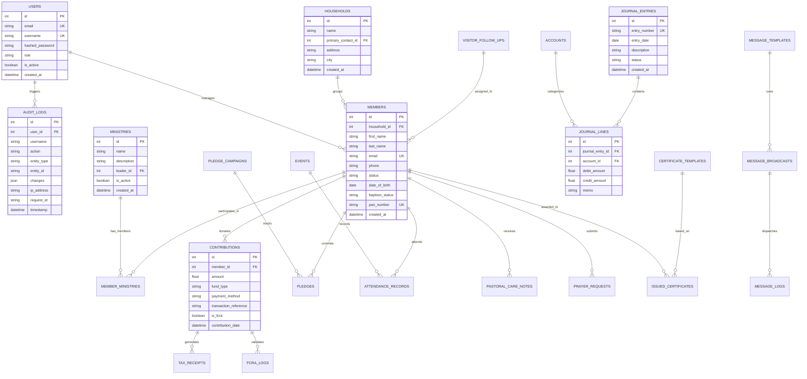

# Ecclesia Database Schema & Relational Architecture

This document specifies the complete relational database schema for the Ecclesia Church Management System (ChMS), including entity-relationship diagrams, table specifications, foreign key relationships, audit logging structures, and Alembic database versioning.

---

## 1. Entity-Relationship Diagram (ERD)



---

## 2. Table Specifications & Data Dictionary

### Core Administration & Access Control

#### `users`
Represents staff, pastors, administrators, and treasurers authorized to access the system.
| Column | Type | Nullable | Description |
| :--- | :--- | :--- | :--- |
| `id` | `INTEGER` | No | Primary Key |
| `email` | `VARCHAR(255)` | No | Unique staff email address (indexed) |
| `username` | `VARCHAR(100)` | No | Unique account handle (indexed) |
| `hashed_password` | `VARCHAR(255)` | No | Bcrypt hashed secret credential |
| `role` | `VARCHAR(50)` | No | RBAC Role (`super_admin`, `admin`, `pastor`, `treasurer`, `staff`, `viewer`) |
| `is_active` | `BOOLEAN` | No | Account status flag |
| `created_at` | `DATETIME` | No | Timestamp of creation |

#### `audit_logs`
Immutable append-only record tracking all administrative mutations and security actions.
| Column | Type | Nullable | Description |
| :--- | :--- | :--- | :--- |
| `id` | `INTEGER` | No | Primary Key (indexed) |
| `user_id` | `INTEGER` | Yes | Foreign Key -> `users.id` (indexed) |
| `username` | `VARCHAR(100)` | Yes | Snapshot of username at time of action (indexed) |
| `action` | `VARCHAR(100)` | No | Mutation verb e.g. `MEMBER_CREATED`, `BACKUP_CREATED` (indexed) |
| `entity_type` | `VARCHAR(100)` | No | Domain model e.g. `Member`, `Contribution` (indexed) |
| `entity_id` | `VARCHAR(100)` | Yes | Entity identifier (indexed) |
| `changes` | `JSON` | Yes | Detailed before/after diff payload |
| `ip_address` | `VARCHAR(45)` | Yes | Client IP address |
| `request_id` | `VARCHAR(64)` | Yes | HTTP Correlation ID (`X-Request-ID`) |
| `timestamp` | `DATETIME` | No | Timestamp of operation (indexed) |

---

### Congregation & Community

#### `members`
Directory of church congregation members, milestones, and demographic data.
| Column | Type | Nullable | Description |
| :--- | :--- | :--- | :--- |
| `id` | `INTEGER` | No | Primary Key (indexed) |
| `household_id` | `INTEGER` | Yes | Foreign Key -> `households.id` |
| `first_name` | `VARCHAR(100)` | No | Member first name |
| `last_name` | `VARCHAR(100)` | No | Member last name |
| `email` | `VARCHAR(255)` | Yes | Member email (indexed) |
| `phone` | `VARCHAR(30)` | Yes | Member phone number |
| `status` | `VARCHAR(30)` | No | Membership status (`Active`, `Inactive`, `Under Discipline`) |
| `date_of_birth` | `DATE` | Yes | Date of birth |
| `baptism_status` | `VARCHAR(50)` | Yes | Sacramental status |
| `pan_number` | `VARCHAR(20)` | Yes | Tax identifier for 80G statutory receipts (indexed) |
| `created_at` | `DATETIME` | No | Timestamp of enrollment |

#### `households`
Family and residential groupings of congregation members.
| Column | Type | Nullable | Description |
| :--- | :--- | :--- | :--- |
| `id` | `INTEGER` | No | Primary Key (indexed) |
| `name` | `VARCHAR(150)` | No | Household family name (e.g. "The Keller Family") |
| `primary_contact_id` | `INTEGER` | Yes | Foreign Key -> `members.id` |
| `address_line1` | `VARCHAR(255)` | Yes | Street address |
| `city` | `VARCHAR(100)` | Yes | City |
| `postal_code` | `VARCHAR(20)` | Yes | Postal code |

---

### Financial Ledger & Double-Entry Accounting

#### `accounts`
Chart of accounts supporting standard fund accounting.
| Column | Type | Nullable | Description |
| :--- | :--- | :--- | :--- |
| `id` | `INTEGER` | No | Primary Key (indexed) |
| `code` | `VARCHAR(20)` | No | Unique account number e.g. `1010-CASH` (indexed) |
| `name` | `VARCHAR(150)` | No | Account name |
| `account_type` | `VARCHAR(30)` | No | `ASSET`, `LIABILITY`, `EQUITY`, `REVENUE`, `EXPENSE` |
| `is_fcra` | `BOOLEAN` | No | FCRA foreign contribution segregation flag |
| `balance` | `FLOAT` | No | Current balance |

#### `journal_entries` & `journal_lines`
Double-entry balanced accounting ledger with debits equaling credits.

---

## 3. Database Schema Versioning with Alembic

Ecclesia uses **Alembic** to manage declarative database schema versioning across development, staging, and production environments.

### Project Structure
```
backend/
├── alembic.ini                   # Alembic configuration
└── alembic/
    ├── env.py                    # Migration execution environment
    ├── script.py.mako            # Migration revision template
    └── versions/
        └── 296f3a7eb6d9_initial_schema.py   # Baseline schema migration
```

### Common Commands

#### Upgrade to Latest Schema
```powershell
cd backend
python -m alembic upgrade head
```

#### Check Current Migration Version
```powershell
python -m alembic current
```

#### Generate a New Autogenerated Migration
```powershell
python -m alembic revision --autogenerate -m "add_ministry_meeting_times"
```

#### Downgrade One Migration
```powershell
python -m alembic downgrade -1
```

---

## 4. Backup & Disaster Recovery

- **Live ACID Snapshots**: Implemented in `app.core.backup.BackupManager` using `sqlite3.backup()` without locking write operations.
- **Gzip Compression**: Backups are automatically compressed with gzip (`.db.gz`).
- **Retention Pruning**: System keeps the last 10 snapshots by default, automatically purging older files.
- **REST Endpoints**: Managed via `POST /api/v1/system/backup`, `GET /api/v1/system/backups`, and `GET /api/v1/system/backups/{filename}/download`.
