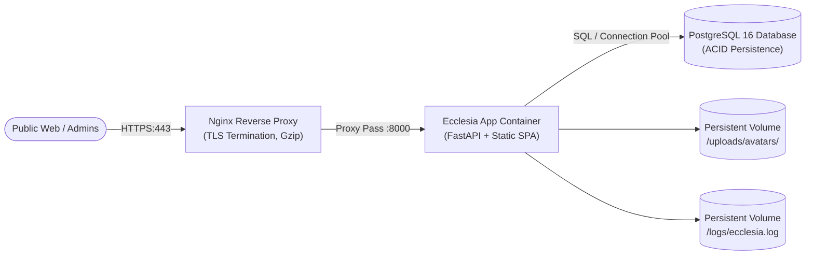

# Ecclesia Production Deployment Guide

**Target Environments**: Docker, Docker Compose, Linux VM (Ubuntu/Debian), Kubernetes, AWS / GCP / Azure  
**Architecture**: FastAPI ASGI Application + React 19 SPA + PostgreSQL 16 + Reverse Proxy (Nginx/Caddy)

---

## 1. Production Architecture Overview

For production deployments, Ecclesia transitions from the local development setup (SQLite + Vite dev server) to a hardened containerized stack:



---

## 2. Docker Container Deployment

Ecclesia features a battle-tested multi-stage [Dockerfile](file:///c:/Users/santh/ecclesia-1/Dockerfile) in the root of the repository.

### Stage 1: Build React SPA
Uses `node:20-alpine` to install dependencies and run `npm run build`, producing an optimized production bundle in `admin-portal/dist/`.

### Stage 2: Production Python Backend
Uses `python:3.11-slim`, installs production Python wheels from `backend/requirements.txt`, copies the compiled frontend assets to be served statically, mounts `/uploads` and `/logs`, and exposes port `8000`.

### Building the Image
```bash
docker build -t ecclesia:latest -f Dockerfile .
```

---

## 3. Production Docker Compose Stack

Create a `docker-compose.prod.yml` file in the root directory:

```yaml
version: '3.8'

services:
  db:
    image: postgres:16-alpine
    container_name: ecclesia_postgres
    restart: always
    environment:
      POSTGRES_USER: ecclesia_admin
      POSTGRES_PASSWORD: ${DB_PASSWORD:-SuperSecureProductionPassword2026!}
      POSTGRES_DB: ecclesia_production
    volumes:
      - postgres_data:/var/lib/postgresql/data
    healthcheck:
      test: ["CMD-SHELL", "pg_isready -U ecclesia_admin -d ecclesia_production"]
      interval: 10s
      timeout: 5s
      retries: 5

  app:
    image: ecclesia:latest
    container_name: ecclesia_app
    restart: always
    depends_on:
      db:
        condition: service_healthy
    environment:
      ENVIRONMENT: production
      DEBUG: "false"
      DATABASE_URL: postgresql+psycopg2://ecclesia_admin:${DB_PASSWORD:-SuperSecureProductionPassword2026!}@db:5432/ecclesia_production
      SECRET_KEY: ${SECRET_KEY}
      ACCESS_TOKEN_EXPIRE_MINUTES: 480
      CORS_ORIGINS: '["https://admin.yourchurch.org", "https://yourchurch.org"]'
      LOG_LEVEL: INFO
      LOG_FILE: logs/ecclesia.log
    volumes:
      - ecclesia_uploads:/app/backend/uploads
      - ecclesia_logs:/app/backend/logs
    expose:
      - "8000"

  nginx:
    image: nginx:alpine
    container_name: ecclesia_nginx
    restart: always
    ports:
      - "80:80"
      - "443:443"
    volumes:
      - ./nginx.conf:/etc/nginx/conf.d/default.conf:ro
      - /etc/letsencrypt:/etc/letsencrypt:ro
    depends_on:
      - app

volumes:
  postgres_data:
  ecclesia_uploads:
  ecclesia_logs:
```

---

## 4. Environment Variables & Secret Configuration

Create a `.env.production` file on your server (ensure this is **never** committed to version control):

```bash
# General
ENVIRONMENT=production
DEBUG=false
PORT=8000

# Security (Generate using: openssl rand -hex 32)
SECRET_KEY=e84f7b2c91a02934f8a0029b4e1837b92f7415e98214a6015b6728c049381e4b
ACCESS_TOKEN_EXPIRE_MINUTES=480

# Database
DATABASE_URL=postgresql+psycopg2://ecclesia_admin:SuperSecureProductionPassword2026!@db:5432/ecclesia_production

# CORS (Restrict to authoritative church domain)
CORS_ORIGINS=["https://admin.yourchurch.org"]

# Logging
LOG_LEVEL=INFO
LOG_FILE=logs/ecclesia.log
```

---

## 5. Nginx Reverse Proxy Configuration

Create `nginx.conf`:

```nginx
server {
    listen 80;
    server_name admin.yourchurch.org;
    return 301 https://$host$request_uri;
}

server {
    listen 443 ssl http2;
    server_name admin.yourchurch.org;

    ssl_certificate /etc/letsencrypt/live/admin.yourchurch.org/fullchain.pem;
    ssl_certificate_key /etc/letsencrypt/live/admin.yourchurch.org/privkey.pem;

    ssl_protocols TLSv1.2 TLSv1.3;
    ssl_ciphers HIGH:!aNULL:!MD5;

    # Maximum upload size for member profile photos & CSVs
    client_max_body_size 10M;

    # Gzip Compression
    gzip on;
    gzip_types text/plain text/css application/json application/javascript text/xml application/xml;

    location / {
        proxy_pass http://app:8000;
        proxy_set_header Host $host;
        proxy_set_header X-Real-IP $remote_addr;
        proxy_set_header X-Forwarded-For $proxy_add_x_forwarded_for;
        proxy_set_header X-Forwarded-Proto $scheme;

        # WebSocket support (if enabled)
        proxy_http_version 1.1;
        proxy_set_header Upgrade $http_upgrade;
        proxy_set_header Connection "upgrade";
    }
}
```

---

## 6. Database Migrations in Production

When launching a new release, execute Alembic migrations inside the application container:

```bash
docker compose -f docker-compose.prod.yml run --rm app alembic upgrade head
```

### Automated Backup Script
Configure a daily cron job to backup the PostgreSQL database:

```bash
#!/bin/bash
BACKUP_DIR="/var/backups/ecclesia"
TIMESTAMP=$(date +"%Y%m%d_%H%M%S")
mkdir -p $BACKUP_DIR

docker exec ecclesia_postgres pg_dump -U ecclesia_admin ecclesia_production | gzip > "$BACKUP_DIR/ecclesia_backup_$TIMESTAMP.sql.gz"

# Retain backups for 30 days
find $BACKUP_DIR -type f -name "*.sql.gz" -mtime +30 -delete
```

---

## 7. Health Checks, Telemetry & Live Backups

### Liveness Probe
Container orchestrators can query:
```bash
curl -f http://localhost:8000/api/v1/health || exit 1
```

### Prometheus Metrics Scraping
Scrape operational telemetry and request latency at:
```bash
curl -s http://localhost:8000/metrics
```

### Automated API Database Snapshots
In addition to native `pg_dump`, automated snapshots can be triggered via the REST API or admin portal:
```bash
curl -X POST http://localhost:8000/api/v1/system/backup \
  -H "Authorization: Bearer <SUPER_ADMIN_JWT_TOKEN>"
```

### Log Aggregation
Logs written to the mounted volume `logs/ecclesia.log` are compatible with log forwarders:
- **Vector / FluentBit / Logstash**: Tail `backend/logs/ecclesia.log` and forward structured JSON or syslog entries to Datadog, Grafana Loki, or AWS CloudWatch.
- **Request IDs**: The `[req_<id>]` token allows instant cross-referencing between frontend error reports and backend database transactions.

