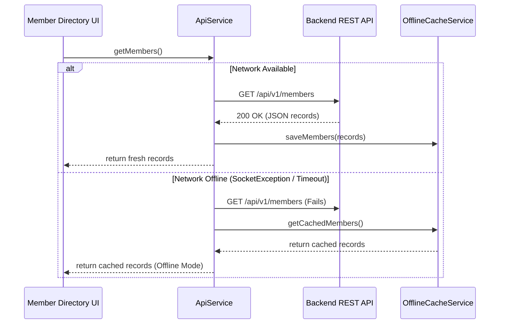

# Ecclesia Mobile Client Architecture & Developer Guide

This document details the software architecture, design patterns, offline caching strategies, and quality assurance workflows for the Ecclesia Flutter mobile application (`mobile/`).

---

## 1. Architectural Overview & Modular Structure

The Ecclesia mobile app is engineered with a **Layered Clean Architecture** separating concerns between domain models, networking/caching services, feature presentation logic, and reusable UI widgets.

```
mobile/
├── lib/
│   ├── core/                      # Application-wide configurations & constants
│   │   └── config.dart            # AppConfig (API URLs, timeouts, retry limits)
│   ├── models/                    # Pure domain models with JSON serialization
│   │   ├── member.dart            # Member, MemberUpdateResult
│   │   └── event.dart             # ChurchEvent (calendar dates, month badges)
│   ├── services/                  # Business logic, networking, and offline caching
│   │   ├── api_service.dart       # HTTP client with offline fallback
│   │   └── cache_service.dart     # OfflineCacheService (memory + disk persistence)
│   ├── features/                  # Domain-specific UI features
│   │   ├── members/               # Congregation directory
│   │   │   ├── members_page.dart  # Searchable list, swipe refresh, filter
│   │   │   └── widgets/
│   │   │       └── member_sheets.dart  # Modal sheets (Add/Edit member)
│   │   └── events/                # Liturgical & activity calendar
│   │       └── events_page.dart   # Events list, date badge, add dialog
│   ├── main.dart                  # Material 3 theme & root routing
│   └── events_page.dart           # Backwards-compatible re-export
└── test/                          # Unit, widget, and offline test suites
    ├── models_test.dart           # Serialization and model logic tests
    ├── offline_cache_test.dart    # Cache TTL and offline fallback tests
    └── widget_test.dart           # Component and UI interaction tests
```

---

## 2. Offline-First Resilience Strategy

To ensure seamless field operation for pastors, deaconesses, and church staff visiting hospital rooms or rural areas with poor connectivity, Ecclesia incorporates an **Offline-First Caching Layer**:



### Key Cache Features
1. **In-Memory + Disk Dual Caching**: Rapid instant reads from memory with disk persistence using JSON files (`cached_members.json`, `cached_events.json`).
2. **Configurable TTL**: Defaults to 24-hour expiration, automatically refreshing when network connectivity is restored.
3. **Graceful Degradation**: Never crashes the app when network errors occur if cached data is present.

---

## 3. Design System & Material 3 Theming

- **Modern Palette**: Tailored Indigo primary palette (`#4F46E5`), Slate scaffold backgrounds (`#0F172A` in dark mode, `#F8FAFC` in light mode).
- **Typography**: Native modern Material 3 typography with clean card elevations, rounded corners (`16px`), and smooth pill badges.
- **Flutter 3.44+ Compatibility**: Uses modern `.withValues(alpha: 0.x)` for alpha blending rather than deprecated `withOpacity()`.

---

## 4. Quality Assurance & Testing

### Run All Mobile Tests
```powershell
cd mobile
flutter test
```
*Current test suite: 13 unit, model, offline fallback, and widget tests passing (100%).*

### Run Static Analysis
```powershell
flutter analyze
```
*Current status: 0 issues found.*
