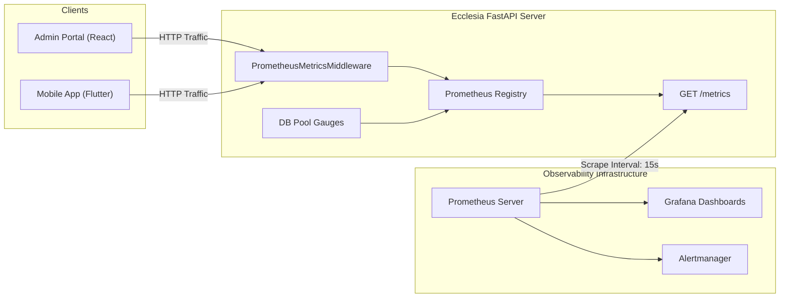

# Ecclesia Observability & Telemetry Guide

This document outlines the operational monitoring, telemetry instrumentation, and alerting framework for the Ecclesia Church Management System.

---

## 1. Overview & Architecture

Ecclesia exposes standard **Prometheus** metrics for operational telemetry, service level objective (SLO) tracking, and capacity planning.



---

## 2. Metric Catalog

All metrics are prefixed with `ecclesia_` and formatted in standard Prometheus exposition text.

| Metric Name | Type | Labels | Description |
| :--- | :--- | :--- | :--- |
| `ecclesia_app_info` | Info | `version`, `service`, `python_version`, `environment` | Application metadata and runtime environment |
| `ecclesia_http_requests_total` | Counter | `method`, `endpoint`, `status_code` | Total HTTP requests handled by method, path pattern, and status code |
| `ecclesia_http_request_duration_seconds` | Histogram | `method`, `endpoint` | Request execution latency distribution (buckets: 5ms to 5s) |
| `ecclesia_http_requests_in_progress` | Gauge | `method`, `endpoint` | Current count of active concurrent requests |
| `ecclesia_db_pool_size` | Gauge | None | Configured maximum capacity of SQLAlchemy database connection pool |
| `ecclesia_db_pool_checked_out_connections` | Gauge | None | Number of active database connections currently checked out |
| `ecclesia_db_pool_overflow_connections` | Gauge | None | Number of overflow connections created beyond pool size |

---

## 3. Prometheus Scrape Configuration (`prometheus.yml`)

Add the following scrape job to your Prometheus server configuration:

```yaml
scrape_configs:
  - job_name: 'ecclesia_api'
    scrape_interval: 15s
    scrape_timeout: 10s
    metrics_path: '/metrics'
    static_configs:
      - targets: ['localhost:8000']
        labels:
          environment: 'production'
          app: 'ecclesia-chms'
```

---

## 4. Grafana Dashboard Panels

Key visualizations recommended for the Ecclesia operations dashboard:

1. **Request Rate (QPS)**:
   ```promql
   sum(rate(ecclesia_http_requests_total[1m])) by (status_code)
   ```
2. **HTTP Latency p95 / p99**:
   ```promql
   histogram_quantile(0.95, sum(rate(ecclesia_http_request_duration_seconds_bucket[5m])) by (le))
   ```
3. **Error Rate (5xx %)**:
   ```promql
   sum(rate(ecclesia_http_requests_total{status_code=~"5.."}[1m])) 
   / 
   sum(rate(ecclesia_http_requests_total[1m])) * 100
   ```
4. **Database Pool Utilization**:
   ```promql
   (ecclesia_db_pool_checked_out_connections / ecclesia_db_pool_size) * 100
   ```

---

## 5. Alerting Rules (`alerts.yml`)

```yaml
groups:
  - name: ecclesia_alerts
    rules:
      - alert: EcclesiaHighErrorRate
        expr: sum(rate(ecclesia_http_requests_total{status_code=~"5.."}[5m])) / sum(rate(ecclesia_http_requests_total[5m])) > 0.05
        for: 2m
        labels:
          severity: critical
        annotations:
          summary: "High HTTP 5xx error rate on Ecclesia API (> 5%)"

      - alert: EcclesiaSlowResponses
        expr: histogram_quantile(0.95, sum(rate(ecclesia_http_request_duration_seconds_bucket[5m])) by (le)) > 2.0
        for: 5m
        labels:
          severity: warning
        annotations:
          summary: "95th percentile latency exceeds 2.0 seconds"

      - alert: EcclesiaDBPoolExhaustion
        expr: ecclesia_db_pool_checked_out_connections >= ecclesia_db_pool_size
        for: 1m
        labels:
          severity: critical
        annotations:
          summary: "Database connection pool near or at 100% capacity"
```
